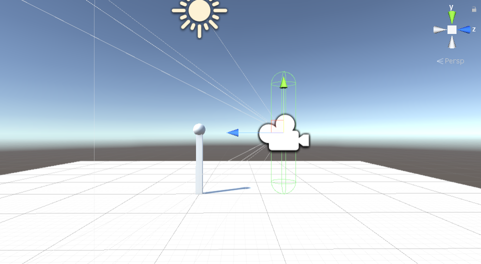

# Unity-VR-Boilerplate

This base program implements rudimentary VR capabilities including HMD tracking, hand movement, grabbing, and collision. The ball on the pedestal can be grabbed and the pedestal cannot be walked through.
